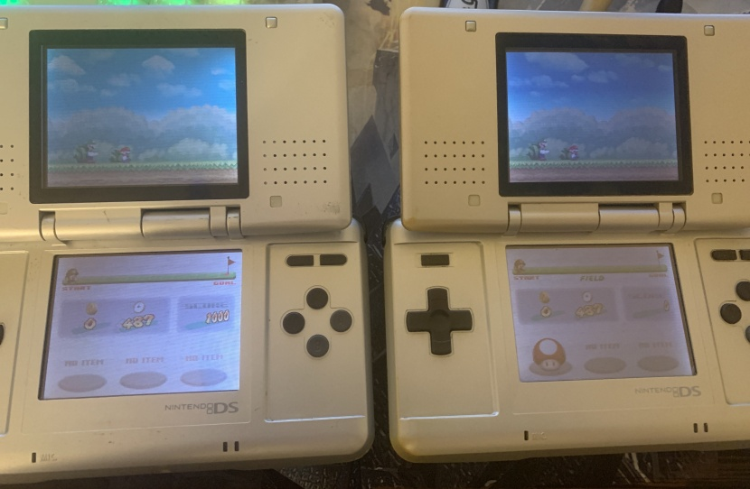

# New Super Mario Bros. E3 2005 demo recreation
This is a recreation of the New Super Mario Bros. demo featured at E3 2005 (and other events in 2005). There's still a lot more to do, but it should be fully playable in single player and multiplayer, and various code hacks are implemented.

To enter the multiplayer mode, press B on the menu. Only multi-cart/multi-ROM play works, not download play.

See [Download and usage](#download-and-usage).

-   [Discord server](https://discord.com/invite/FEP5sgP) (discussion and small previews)
-   [NSMBHD thread](https://nsmbhd.net/thread/5516-new-super-mario-bros-e3-2005-demo-recreation/) (discussion, plus videos and more screenshots)

## FAQ
**How can I help?** 
What we most need at the moment is more photos and videos of the demo, and more info from people who played the demo. Please tell us if you think you may be able to help, or know somebody who may be able to help.
Here is a (messy) page containing the info we currently have:
https://tcrf.net/Prerelease:New_Super_Mario_Bros./2005/Demo

**When will the finished recreation be released?** 
There is no estimated release date.

**Does the recreation aim to be fully accurate to the demo?** 
Yes, but this is currently limited by the amount of footage and information we have of/on the demo.

**When will the next update be?** 
The project is still ongoing - there isn't really any reason to discontinue it, except if the real demo was leaked. There is a code refactor branch, which includes some new features, and there are some asset improvements in the `to_implement` folder, plus various additions that haven't been added to the repo yet. There isn't a schedule for updates, and it depends on free time and motivation. However the assets in `to_implement` are low-hanging fruit if someone wants to make a pull request.

## Download and usage
Download the patch from [releases](https://github.com/mariomadproductions/nsmb-e3-rec/releases)

Try the xdelta2 file first - if that doesn't work, try the xdelta3 file.

Patching tools for different platforms (in order of ease of use):

-   https://www.marcrobledo.com/RomPatcher.js/ (javascript web app, only works with xdelta2 files)
-   https://kotcrab.github.io/xdelta-wasm/ (webassembly web app, only partial xdelta3 support?)
-   https://github.com/btimofeev/UniPatcher (Android)
-   https://github.com/marco-calautti/DeltaPatcher/releases (Windows)
-   https://github.com/dan0v/xdelta3-cross-gui/releases (Windows, Mac, Linux)
-   https://github.com/jmacd/xdelta-gpl/releases (Windows, Mac, Linux) (command line program)

You should patch a clean NSMB USA ROM[2](#notes).

## Playing
At least one version has been successfully tested on the following:

-   DeSmuME
-   MelonDS
-   nds-bootstrap using the TWiLight Menu++ frontend
-   R4i-SDHC 3DS RTS flashcard (default firmware)
-   Acekard 2i (AKAIO)
-   Wii U's Nintendo DS Virtual Console (hachihachi)
-   M3 DS Real (ysmenu)

It should work on all DS and 3DS consoles.

## Known issues
Bugs are documented here:
https://github.com/mariomadproductions/nsmb-e3-rec/issues

Workarounds/unimplemented things that may seem like bugs:
-   No sound effect for wall jumping
-   No Mega Goomba in the Field level
-   Static lifts instead of lift spawner at start of Fortress
-   No Whomps in the Fortress level
-   "! Switch"-activated coins in the Desert level can't be collected

There are of course many other unimplemented things, that are obviously just not implemented yet.

## Building
Prerequisites:

General building tools:
 - Git
 - GNU Arm Embedded Toolchain
 - GNU Make

Note: You can install these via your package manager. Tested options on Windows are [msys2 mingw's official distribution](https://www.msys2.org/) (relevant pacman package name: `mingw-w64-x86_64-arm-none-eabi-gcc`), [devkitPro's msys2 distribution](https://github.com/devkitPro/installer/releases), and [ARM's official msys2 mingw64 distribution](https://developer.arm.com/downloads/-/arm-gnu-toolchain-downloads). The mingw 

Scripting:
 - Python 3

Modding specific:
 - [ndspy](https://pypi.org/project/ndspy/)
 - [NSMBe](https://github.com/TheGameratorT/NSMB-Editor/releases) (v5.3 or later)
 - NitroSDK (tested with NitroSDK-3_0-060125[1](#notes))
 - Clean NSMB USA ROM[2](#notes)

Steps:
 - Clone the repo.
 - Go into the repo folder.
 - Copy the NitroSDK ``include`` folder contents into the repo `include` folder.
 - Run `convert_sdk.py`.
 - Place the ROM as ``rom.nds`` in the repo.
 - Run `insert_files.py rom.nds`.
 - Open `rom.nds` in NSMB Editor.
 - Go to the `Tools/Options` tab and click `Run 'make' and insert`. If you get a error message box just click continue.

## Tools used
In addition to those listed in the build instructions.
-   Paint.NET
-   GIMP
-   Nitro Studio 2
-   Blender
-   Nitro Model Converter GUI
-   NDS Banner Editor

## Credits

-   Hiccup - Research, direction, levels, sound edits and minor graphics
-   TheGameratorT - Coding and minor graphics
-   Alzter - Graphics
-   Zeferrao/Pengu - Sound edits

### Special Thanks

-   KTRMAmbiance (aka Ambiance69) - Graphics
-   mrrikihino - Graphics
-   MeroMero - No level freeze code (nofreeze.s)
-   Ed_IT - Helped with custom sprite code
-   Doc_Static (aka Mspeter97) - First-hand demo information
    (was present at E3 2005)
-   SiropDeViolette (aka Simpson55) - First-hand demo
    information (was present at E3 2005)
-   KingYoshi - Research/translation of Dutch news articles
-   All contributors to the original
    [Beta Replica project](https://nsmbhd.net/thread/2198-nsmb-beta-replica-2005-demo-replica-v1-released/) (MarioFanatic64,
    Thierry et al)
-   All contributors to the TCRF page

## Notes
1\.  
> Common filename: NitroSDK-3_0-060125.zip  
> Size: 58349333  
> CRC32: c023d994  
> MD5: eed72648a1a10a622ee65b7ee5d3e7f4  
> SHA1: 36b7d2f66b828f5575e96c4c689c2aaa592304f6  
> SHA256: b791c9e331bc0b2026c58c8cec0ea74a496b0594ea03c272af3f75b726a656cf

2\.  
> Common filename: New Super Mario Bros (USA).nds  
> Size: 33554432  
> CRC32: 0197576a  
> MD5: a2ddba012e5c3c2096d0be57cc273be5  
> SHA1: a22713711b5cd58dfbafc9688dadea66c59888ce  
> SHA256: 9f67fef1b4c73e966767f6153431ada3751dc1b0da2c70f386c14a5e3017f354
