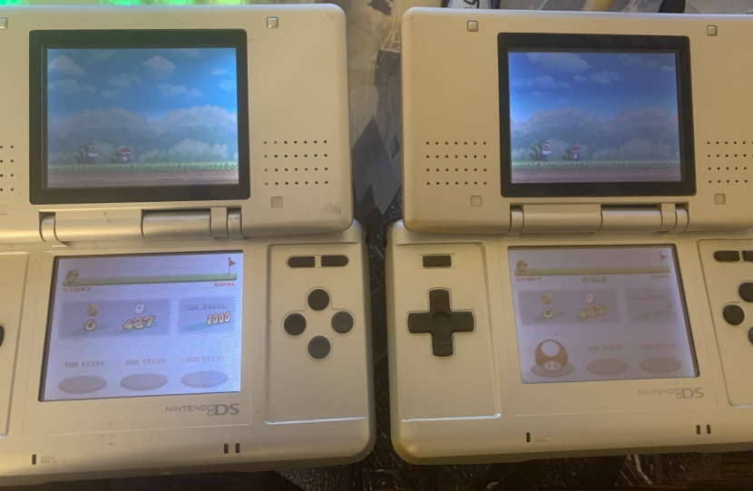

# New Super Mario Bros. E3 2005 demo recreation
This is a recreation of the New Super Mario Bros. demo featured at E3 2005 (and other events in 2005). There's still a lot more to do, but it should be fully playable in single player and multiplayer, and various code hacks are implemented.

To enter the multiplayer mode, press B on the menu. Only multi-cart/multi-ROM play works, not download play.

See [Download and usage](#download-and-usage).

-   [Discord server](https://discord.com/invite/FEP5sgP) (discussion and small previews)
-   [NSMBHD thread](https://nsmbhd.net/thread/5516-new-super-mario-bros-e3-2005-demo-recreation/) (discussion, plus videos and more screenshots)

## FAQ
**How can I help?** 
What we most need at the moment is more photos and videos of the demo, and more info from people who played the demo. Please tell us if you think you may be able to help, or know somebody who may be able to help.
Here are (messy) pages containing the info we currently have:
https://tcrf.net/Prerelease:New_Super_Mario_Bros./2005/Demo  
https://tcrf.net/User:Trash_Bandatcoot/rewrite

**When will the finished recreation be released?** 
There is no estimated release date.

**Does the recreation aim to be fully accurate to the demo?** 
Yes, but this is currently limited by the amount of footage and information we have of/on the demo.

**When will the next update be?** 
The project is still ongoing - there isn't really any reason to discontinue it, except if the real demo was leaked. There are quite a few changes here in the git repo, which a release hasn't been created for yet, as things still need importing, polishing and testing. There isn't a schedule for updates, and it depends on free time and motivation.

## Download and usage
Download the patch from [releases](https://github.com/mariomadproductions/nsmb-e3-rec/releases)

Try the xdelta2 file first - if that doesn't work, try the xdelta3 file.

Patching tools for different platforms (in order of ease of use):

-   https://www.marcrobledo.com/RomPatcher.js/ (javascript web app, only works with xdelta2 files)
-   https://kotcrab.github.io/xdelta-wasm/ (webassembly web app, only partial xdelta3 support?)
-   https://github.com/btimofeev/UniPatcher (Android)
-   https://github.com/marco-calautti/DeltaPatcher/releases (Windows)
-   https://github.com/dan0v/xdelta3-cross-gui/releases (Windows, Mac, Linux)
-   https://github.com/jmacd/xdelta-gpl/releases (Windows, Mac, Linux) (command line program)

You should patch a clean NSMB USA ROM[^rom].

## Playing
At least one version has been successfully tested on the following:

-   DeSmuME
-   MelonDS
-   nds-bootstrap using the TWiLight Menu++ frontend
-   R4i-SDHC 3DS RTS flashcard (default firmware)
-   Acekard 2i (AKAIO)
-   Wii U's Nintendo DS Virtual Console (hachihachi)
-   M3 DS Real (ysmenu)

It should work on all DS and 3DS consoles.

## Known issues
Bugs are documented here:
https://github.com/mariomadproductions/nsmb-e3-rec/issues

Workarounds/unimplemented things that may seem like bugs:
-   No sound effect for wall jumping
-   No Mega Goomba in the Field level
-   Static lifts instead of lift spawner at start of Fortress
-   No Whomps in the Fortress level
-   "! Switch"-activated coins in the Desert level can't be collected

There are of course many other unimplemented things, that are obviously just not implemented yet.

## Building
 - Clone the repo.
 - Go into the repo folder.
 - Place the ROM as ``rom.nds``[^rom] in the repo.
 - Run `insert_files.py rom.nds`.
 - Clone the NSMB code reference [NSMB-Code-Reference](https://github.com/MammaMiaTeam/NSMB-Code-Reference) and check out the commit listed in `docs/nsmb_code_reference_version.txt`, then point the `NSMBREF_ROOT` environment variable at it.
 - Follow the [NSMB-Code-Template](https://github.com/MammaMiaTeam/NSMB-Code-Template) NSMBe instructions

## Tools and resources used
-   [NSMBe](https://github.com/MammaMiaTeam/NSMB-Editor)
-   [NSMB-Code-Reference](https://github.com/MammaMiaTeam/NSMB-Code-Reference)
-   [NSMB-Code-Template](https://github.com/MammaMiaTeam/NSMB-Code-Template)
-   Paint.NET
-   GIMP
-   Nitro Studio 2
-   Blender
-   [Nitro Model Converter GUI](https://github.com/TheGameratorT/NitroModel_ConverterGUI)
-   [NDS Banner Editor](https://github.com/TheGameratorT/NDS_Banner_Editor)

## Credits
-   Hiccup - Research, general direction, level recreation, sound edits and minor graphics
-   TheGameratorT - Coding and minor graphics
-   Alzter - Graphics
-   Zeferrao/Pengu - Sound edits

### Special Thanks
-   KTRMAmbiance (aka Ambiance69) - Graphics
-   mrrikihino - Graphics
-   MeroMero - No level freeze code (nofreeze.s)
-   Ed_IT - Helped with custom sprite code
-   Doc_Static (aka Mspeter97) - Demo information
-   SiropDeViolette (aka Simpson55) - Demo
    information
-   KingYoshi - Research/translation of Dutch news articles
-   All contributors to the original
    [Beta Replica project](https://nsmbhd.net/thread/2198-nsmb-beta-replica-2005-demo-replica-v1-released/) (MarioFanatic64,
    Thierry et al)
-   All contributors to the [TCRF page](https://tcrf.net/New_Super_Mario_Bros.)

[^rom]: Common filename: New Super Mario Bros (USA).nds  
    Size: 33554432  
    CRC32: 0197576a  
    MD5: a2ddba012e5c3c2096d0be57cc273be5  
    SHA1: a22713711b5cd58dfbafc9688dadea66c59888ce  
    SHA256: 9f67fef1b4c73e966767f6153431ada3751dc1b0da2c70f386c14a5e3017f354  
    Internal serial and version: A2DE v0
